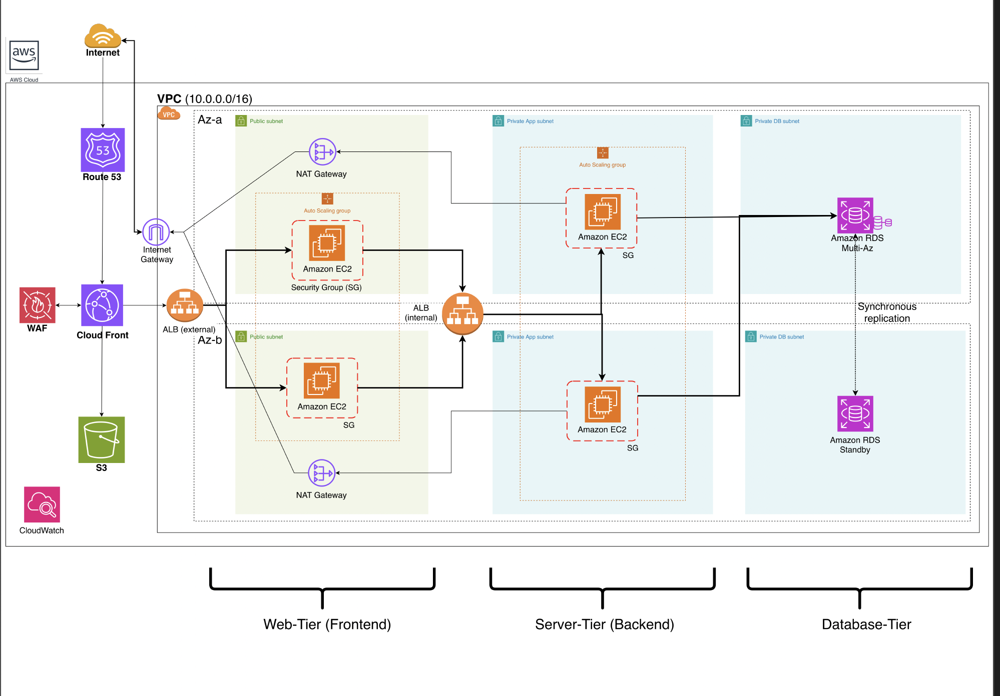
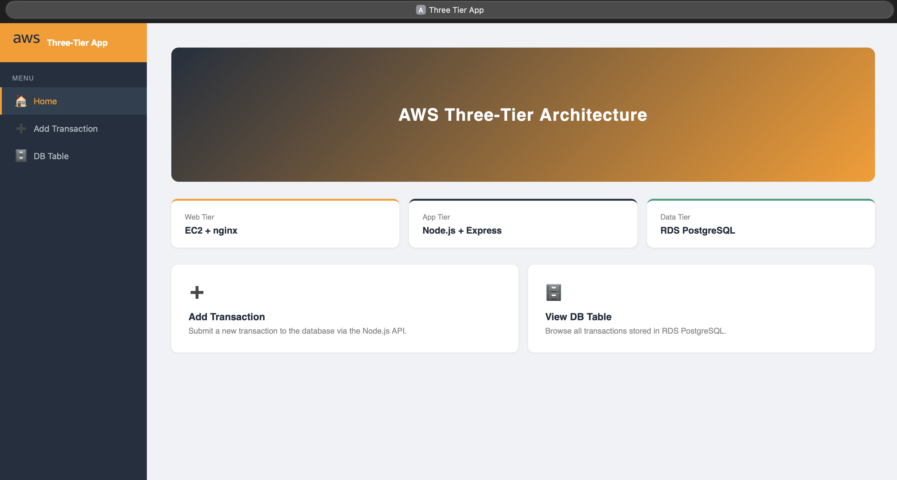
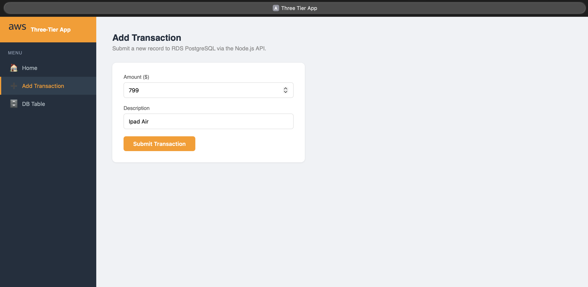
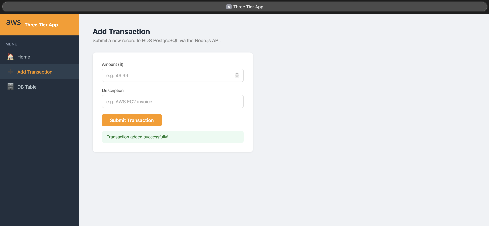
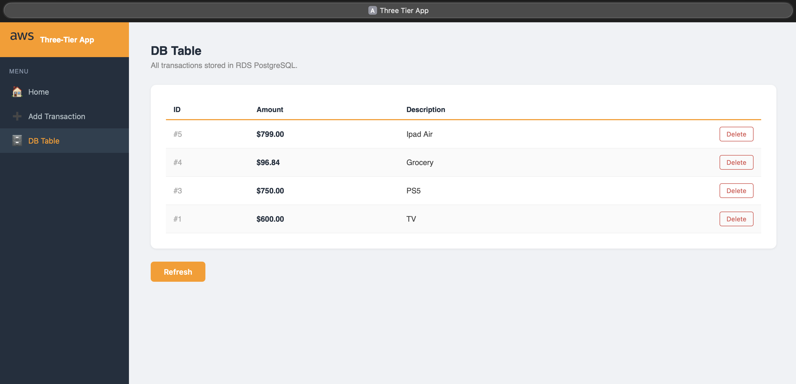
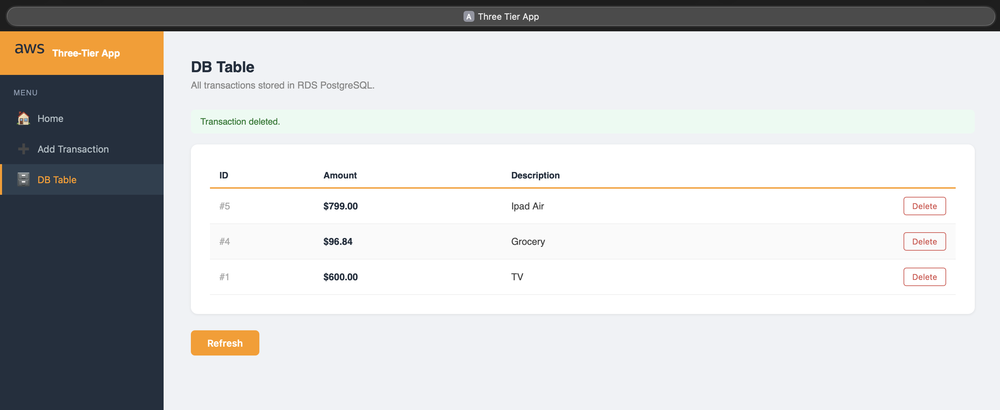
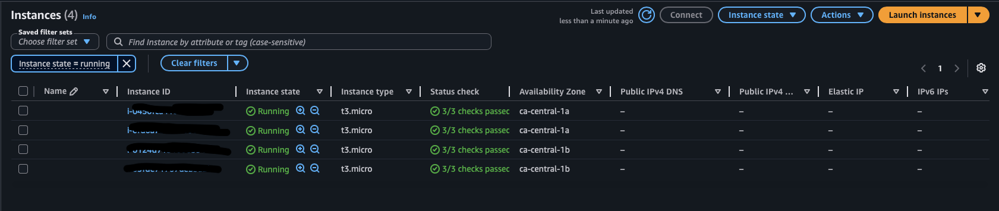
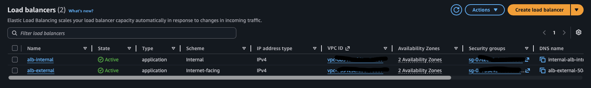
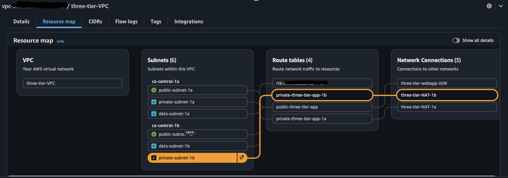
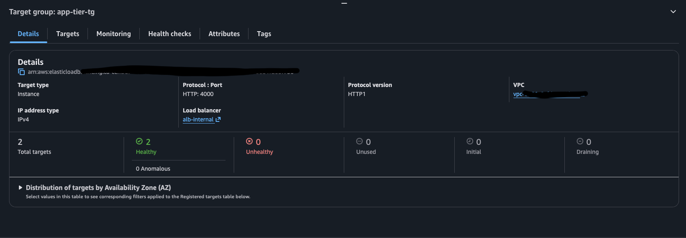

# AWS Three-Tier Web Application

A production-grade, highly available three-tier web application deployed on AWS.
Built with React (web tier), Node.js/Express (app tier), and PostgreSQL on RDS (data tier).

---

## Architecture

---

## Tech Stack

| Tier | Technology | AWS Service |
|------|-----------|-------------|
| Web | React + nginx | EC2 Auto Scaling Group |
| App | Node.js + Express | EC2 Auto Scaling Group |
| Data | PostgreSQL 16 | RDS Multi-AZ |
| CDN | - | CloudFront + WAF |
| DNS | - | Route 53 |
| Load Balancing | - | ALB (External + Internal) |
| Networking | - | VPC, Subnets, NAT Gateway, IGW |
| Monitoring | - | CloudWatch |

---

## Features

- **High Availability** — deployed across 2 Availability Zones (ca-central-1a + ca-central-1b)
- **Auto Scaling** — EC2 scales from 2 to 6 instances based on CPU (60% threshold)
- **Security** — WAF blocks SQLi/XSS, security group chain (ALB → frontend → backend → RDS)
- **Disaster Recovery** — RDS Multi-AZ with automatic failover under 60 seconds
- **CDN** — CloudFront distribution reduces latency for static assets
- **Zero direct EC2 access** — all traffic flows through load balancers only

---

## Application

A transaction manager app with three pages:

| Page | Description |
|------|-------------|
| Home | Dashboard with architecture tier overview |
| Add Transaction | Form that POSTs to Node.js API → saves to RDS PostgreSQL |
| DB Table | Fetches and displays all transactions from RDS |

---

## Screenshots

### Home Page

### Add Transaction

### DB Table

### DB Table Delete

### AWS Console — EC2 Instances

### AWS Console — Load Balancers

### AWS Console — VPC Resource Map

### AWS Console — Healthy Targets

---

## Deployment Overview

1. VPC, subnets, IGW, NAT Gateways, route tables
2. Security Groups (sg-alb, sg-frontend, sg-backend, sg-rds)
3. RDS PostgreSQL with Multi-AZ
4. App tier EC2 setup → AMI → Launch Template → ASG + Internal ALB
5. Web tier EC2 setup → AMI → Launch Template → ASG + External ALB
6. CloudFront distribution + WAF
7. Route 53 DNS record

---

## Certifications

This project was built as part of my AWS learning path:
- AWS Certified Cloud Practitioner (CCP)
- AWS Certified Solutions Architect – Associate (SAA)
